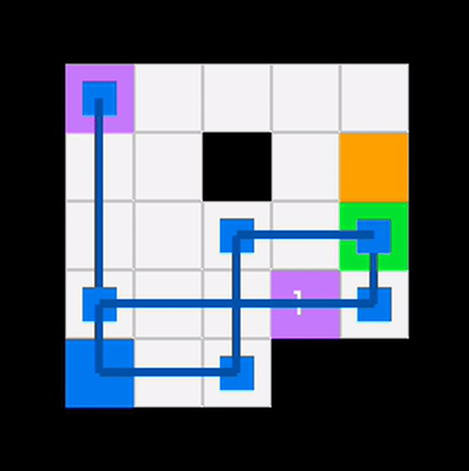

## ***ICE SLIDING PHYSICS***



##  👤 Author:
- ### 13524130 - Faris Wirakusuma
- ### 13524144 - Jonathan Harijadi

---
> [!IMPORTANT]
> **Kontrol Navigasi Eksklusif Keyboard**: Seluruh interaksi dalam program ini menggunakan input keyboard. **Tidak ada** dukungan kontrol menggunakan **mouse**.

.

> [!NOTE]
> **Lokasi Penyimpanan File**: File yang sudah tersimpan akan muncul pada lokasi `output/solusi.txt`.
---
## Penjelasan singkat program

Program ini dirancang untuk menyelesaikan permasalahan navigasi pada grid licin (Ice Sliding Physics), di mana aktor hanya bisa berhenti jika menabrak rintangan atau mencapai tepi peta. Program mengekstraksi data dari file teks yang berisi representasi visual peta dan bobot biaya (cost) setiap ubin.


###  Arsitektur
- Engine Pencarian: Menggunakan base class PathFinder untuk memastikan standarisasi fungsi step(), isFinished(), dan pengambilan koordinat jalur di seluruh algoritma.
  
- Manajemen Algoritma:A*: Mengoptimalkan pencarian dengan menggabungkan biaya aktual ($g$) dan estimasi jarak heuristik ($h$).


  
-  UCS & Dijkstra: Menjamin rute termurah dengan murni mengevaluasi akumulasi biaya aktual ($g$) tanpa panduan heuristik.Greedy Best-First Search: Memprioritaskan kecepatan eksekusi dengan hanya mempertimbangkan jarak terdekat ke target melalui fungsi heuristik ($h$).
  
-  Visualisasi GUI: Menggunakan Raylib untuk menampilkan proses ekspansi node secara real-time, statistik mesin (Iterasi, Waktu, Cost), dan fitur playback untuk meninjau langkah solusi.Sistem Log & Ekspor: Menyediakan fitur penyimpanan otomatis hasil pencarian ke dalam file solusi.txt dengan mode append untuk dokumentasi histori pengujian.

## Requirement program:

* **Raylib v4.5+**: Library utama untuk GUI dan Rendering.
* **GCC/G++**: Mendukung standar C++17.
* **Make/CMake**: Untuk sistem build otomatis.

## Build dan Run
- ### Kompilasi
Gunakan make untuk mengompilasi program:

```Bash
make build # untuk build
make run # untuk run
make build && make run # untuk build dan run
```

Jika berhasil, file executable akan muncul di direktori bin/.

- ### Menjalankan Program
  - #### Jalankan command berikut untuk merun program:

```Bash
./bin/<nama_executable>
```
- ### 📂 Load File
   - #### Tekan tombol [1] pada menu utama untuk membuka dialog pencarian file. lalu load txt file pada : <code>test/input/<nama_txtfile>.txt </code>

- ### Kontrol GUI
  - Pencarian: Klik tombol algoritma (A*/UCS/Algoritma lainnya) untuk memulai searching.

  - Playback: Tekan [P] setelah status SUCCESS.

  - [Panah Kanan/Kiri]: Maju/Mundur satu langkah.

  - [Space]: Play/Pause otomatis.

  - [+/-]: Menambah/Mengurangi kecepatan playback.

  - [ESC]: Jump ke langkah spesifik.

- ### Navigasi:

  - [S]: Simpan solusi ke file .txt. 

  - [B]: Kembali ke menu/pilihan peta.

  - [Q]: Keluar dari program.
  
